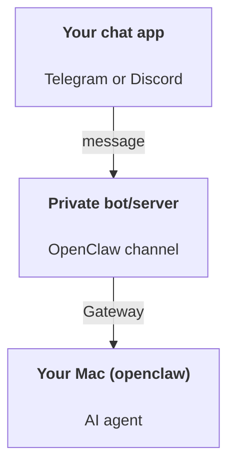

OpenClaw is a self-hosted gateway that connects Telegram and Discord to AI agents. This guide covers a personal assistant setup: a private bot or Discord server that behaves like your always-on AI assistant.

## ⚠️ Safety first

You're putting an agent in a position to:

- run commands on your machine (depending on your tool policy)
- read/write files in your workspace
- send messages back out via Telegram or Discord

Start conservative:

- Use pairing or explicit allowlists before you trust the assistant with private chats.
- Use a private Telegram bot or private Discord server for the assistant.
- Heartbeats now default to every 30 minutes. Disable until you trust the setup by setting `agents.defaults.heartbeat.every: "0m"`.

## Prerequisites

- OpenClaw installed and onboarded - see [Getting Started](/start/getting-started) if you haven't done this yet
- A Telegram bot token or Discord bot token

## Private bot setup

You want this:



Keep the bot or server private until pairing, allowlists, and tool approvals are configured.

## 5-minute quick start

1. Run onboarding:

```bash
openclaw onboard
```

2. Add Telegram or Discord:

```bash
openclaw channels add --channel telegram --token <bot-token>
openclaw channels add --channel discord --token <bot-token>
```

3. Start the Gateway (leave it running):

```bash
openclaw gateway --port 18789
```

4. For file-based Telegram setup, the minimal channel config is:

```json5
{
  gateway: { mode: "local" },
  channels: {
    telegram: {
      enabled: true,
      botToken: "123:abc",
      dmPolicy: "pairing",
    },
  },
}
```

Now message the bot and complete pairing or allowlist setup.

When onboarding finishes, OpenClaw auto-opens the dashboard and prints a clean (non-tokenized) link. If the dashboard prompts for auth, paste the configured shared secret into Control UI settings. Onboarding uses a token by default (`gateway.auth.token`), but password auth works too if you switched `gateway.auth.mode` to `password`. To reopen later: `openclaw dashboard`.

## Give the agent a workspace (AGENTS)

OpenClaw reads operating instructions and "memory" from its workspace directory.

By default, OpenClaw uses `~/.openclaw/workspace` as the agent workspace, and will create it (plus starter `AGENTS.md`, `SOUL.md`, `TOOLS.md`, `IDENTITY.md`, `USER.md`, `HEARTBEAT.md`) automatically on setup/first agent run. `BOOTSTRAP.md` is only created when the workspace is brand new (it should not come back after you delete it). `MEMORY.md` is optional (not auto-created); when present, it is loaded for normal sessions. Subagent sessions only inject `AGENTS.md` and `TOOLS.md`.

<Tip>
Treat this folder like OpenClaw's memory and make it a git repo (ideally private) so your `AGENTS.md` and memory files are backed up. If git is installed, brand-new workspaces are auto-initialized.
</Tip>

```bash
openclaw setup
```

Full workspace layout + backup guide: [Agent workspace](/concepts/agent-workspace)
Memory workflow: [Memory](/concepts/memory)

Optional: choose a different workspace with `agents.defaults.workspace` (supports `~`).

```json5
{
  agents: {
    defaults: {
      workspace: "~/.openclaw/workspace",
    },
  },
}
```

If you already ship your own workspace files from a repo, you can disable bootstrap file creation entirely:

```json5
{
  agents: {
    defaults: {
      skipBootstrap: true,
    },
  },
}
```

## The config that turns it into "an assistant"

OpenClaw defaults to a good assistant setup, but you'll usually want to tune:

- persona/instructions in [`SOUL.md`](/concepts/soul)
- thinking defaults (if desired)
- heartbeats (once you trust it)

Example:

```json5
{
  logging: { level: "info" },
  agents: {
    defaults: {
      model: { primary: "openai/gpt-5.5" },
      workspace: "~/.openclaw/workspace",
      thinkingDefault: "high",
      timeoutSeconds: 1800,
      // Start with 0; enable later.
      heartbeat: { every: "0m" },
    },
    list: [
      {
        id: "main",
        default: true,
        groupChat: {
          mentionPatterns: ["@openclaw", "openclaw"],
        },
      },
    ],
  },
  channels: {
    telegram: {
      enabled: true,
      dmPolicy: "pairing",
      groups: {
        "*": { requireMention: true },
      },
    },
  },
  session: {
    scope: "per-sender",
    resetTriggers: ["/new", "/reset"],
    reset: {
      mode: "daily",
      atHour: 4,
      idleMinutes: 10080,
    },
  },
}
```

## Sessions and memory

- Session files: `~/.openclaw/agents/<agentId>/sessions/{{SessionId}}.jsonl`
- Session metadata (token usage, last route, etc): `~/.openclaw/agents/<agentId>/sessions/sessions.json` (legacy: `~/.openclaw/sessions/sessions.json`)
- `/new` or `/reset` starts a fresh session for that chat (configurable via `resetTriggers`). If sent alone, OpenClaw acknowledges the reset without invoking the model.
- `/compact [instructions]` compacts the session context and reports the remaining context budget.

## Heartbeats (proactive mode)

By default, OpenClaw runs a heartbeat every 30 minutes with the prompt:
`Read HEARTBEAT.md if it exists (workspace context). Follow it strictly. Do not infer or repeat old tasks from prior chats. If nothing needs attention, reply HEARTBEAT_OK.`
Set `agents.defaults.heartbeat.every: "0m"` to disable.

- If `HEARTBEAT.md` exists but is effectively empty (only blank lines and markdown headers like `# Heading`), OpenClaw skips the heartbeat run to save API calls.
- If the file is missing, the heartbeat still runs and the model decides what to do.
- If the agent replies with `HEARTBEAT_OK` (optionally with short padding; see `agents.defaults.heartbeat.ackMaxChars`), OpenClaw suppresses outbound delivery for that heartbeat.
- By default, heartbeat delivery to DM-style `user:<id>` targets is allowed. Set `agents.defaults.heartbeat.directPolicy: "block"` to suppress direct-target delivery while keeping heartbeat runs active.
- Heartbeats run full agent turns - shorter intervals burn more tokens.

```json5
{
  agents: {
    defaults: {
      heartbeat: { every: "30m" },
    },
  },
}
```

## Media in and out

Inbound attachments (images/audio/docs) can be surfaced to your command via templates:

- `{{MediaPath}}` (local temp file path)
- `{{MediaUrl}}` (pseudo-URL)
- `{{Transcript}}` (if audio transcription is enabled)

Outbound attachments from the agent: include `MEDIA:<path-or-url>` on its own line (no spaces). The directive must start the line as plain text, outside code fences and without Markdown wrappers such as bold or inline code. Example:

```
Here's the screenshot.
MEDIA:https://example.com/screenshot.png
```

OpenClaw extracts these and sends them as media alongside the text.

These forms are not attachment directives and are sent as normal text:

```md
**MEDIA:https://example.com/screenshot.png**
`MEDIA:https://example.com/screenshot.png`
Here is the screenshot: MEDIA:https://example.com/screenshot.png
```

Local-path behavior follows the same file-read trust model as the agent:

- If `tools.fs.workspaceOnly` is `true`, outbound `MEDIA:` local paths stay restricted to the OpenClaw temp root, the media cache, agent workspace paths, and sandbox-generated files.
- If `tools.fs.workspaceOnly` is `false`, outbound `MEDIA:` can use host-local files the agent is already allowed to read.
- Local paths can be absolute, workspace-relative, or home-relative with `~/`.
- Host-local sends still only allow media and safe document types (images, audio, video, PDF, and Office documents). Plain text and secret-like files are not treated as sendable media.

That means generated images/files outside the workspace can now send when your fs policy already allows those reads, without reopening arbitrary host-text attachment exfiltration.

## Operations checklist

```bash
openclaw status          # local status (creds, sessions, queued events)
openclaw status --all    # full diagnosis (read-only, pasteable)
openclaw status --deep   # asks the gateway for a live health probe with channel probes when supported
openclaw health --json   # gateway health snapshot (WS; default can return a fresh cached snapshot)
```

Logs live under `/tmp/openclaw/` (default: `openclaw-YYYY-MM-DD.log`).

## Next steps

- Gateway ops: [Gateway runbook](/gateway)
- Cron + wakeups: [Cron jobs](/automation/cron-jobs)
- macOS menu bar companion: [OpenClaw macOS app](/platforms/macos)
- iOS node app: [iOS app](/platforms/ios)
- Android node app: [Android app](/platforms/android)
- Windows status: [Windows (WSL2)](/platforms/windows)
- Linux status: [Linux app](/platforms/linux)
- Security: [Security](/gateway/security)

## Related

- [Getting started](/start/getting-started)
- [Setup](/start/setup)
- [Channels overview](/channels)
